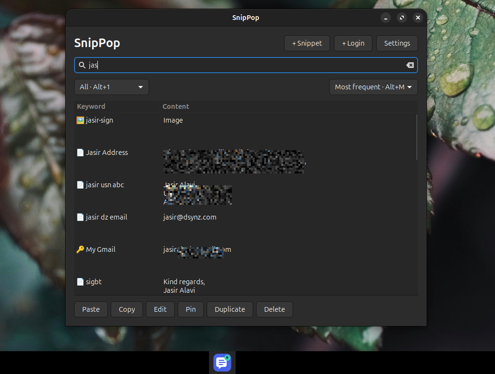

# SnipPop

A lightweight, keyboard-first snippet manager for Linux. Store reusable text, formatted signatures, tables, images, links, and logins; find them in a popup and paste into the app you were using.

SnipPop uses Python, GTK 3, WebKitGTK, SQLite, and the desktop keyring. It works locally without an account or cloud service.



## Features

- One rich-content editor; plain text is generated automatically.
- Rich or plain paste, with native PNG clipboard data for image-only snippets.
- Search keywords and content, or filter by `#tag`.
- Pinned entries, content-type filters, and newest/oldest/most-frequent sorting.
- Login entries with username, keyring-stored password, and website link.
- Three-line result previews and type icons beside keywords.
- Optional tags, configurable search memory, and close-after-paste settings.
- Date/time placeholders, references to other snippets, JSON import/export, Trash, and rotating database backups.

**Status:** early release. Chrome rich-content and LibreOffice Writer clipboard checks passed. Firefox paste remains unresolved in the test environment; Gmail, Google Docs, and GIMP-specific behavior is not yet verified. See [compatibility notes](COMPATIBILITY.md).

## Install

The commands below target an Ubuntu/Debian desktop with GTK 3 and WebKitGTK 4.1 packages available.

### 1. Install dependencies

```sh
sudo apt update
sudo apt install git python3 python3-gi python3-gi-cairo \
  gir1.2-gtk-3.0 gir1.2-webkit2-4.1 gir1.2-secret-1
```

Login entries also require a running Secret Service-compatible desktop keyring, such as GNOME Keyring. The desktop normally starts and unlocks it when you sign in.

For **X11 direct paste**, install `xdotool`:

```sh
sudo apt install xdotool
```

For **Wayland direct paste**, configure `ydotool` and its daemon for your distribution. SnipPop expects a working socket at `$YDOTOOL_SOCKET` or `/run/user/$UID/.ydotool_socket`. It does not install a privileged input service or change device permissions. Copy actions remain available without a paste helper.

### 2. Download and install SnipPop

```sh
git clone https://github.com/jasiralavi/SnipPop.git snippop-source
cd snippop-source
/usr/bin/python3 install.py
```

The installer copies the app to `~/Softwares/SnipPop` and adds **SnipPop** to your application menu. Keep the source checkout separate from that installation directory.

Launch from the application menu or run:

```sh
~/Softwares/SnipPop/launch_snippop.sh
```

You can also run `./launch_snippop.sh` directly from the source checkout without installing. Use system Python (`/usr/bin/python3`) so the desktop libraries are available.

### 3. Assign a global shortcut

In your desktop's **Keyboard → Custom Shortcuts**, add:

- **Name:** SnipPop
- **Command:** the full path to `~/Softwares/SnipPop/launch_snippop.sh` (replace `~` with your home directory)
- **Shortcut:** your preference, for example **Super+X**, if unused

The optional GNOME helper, `/usr/bin/python3 register_shortcut.py`, assigns **Ctrl+Super+X** if available. It does not configure Super+X automatically.

Invoking the launcher again brings the existing instance forward. On X11 it also centers the window on the current monitor; native Wayland placement and activation remain compositor-dependent.

## First snippet

1. Open SnipPop and press **Ctrl+N**.
2. Enter a unique keyword, such as `email.signature`.
3. Write or paste formatted content. Use **Image** to embed a local image, or **Capture clipboard** to replace the editor contents with the current clipboard.
4. Press **Ctrl+S** to save.
5. Focus the destination field in another app, invoke SnipPop, and search for your keyword.
6. Press **Enter** to paste rich content or **Ctrl+Enter** to paste plain text.

There is no separate plain-text editor. Images without text have no plain-paste version. Linked/remote images are removed during HTML cleanup; insert local copies instead. Complex formatting may change in the destination, and whole-document settings such as headers and page margins are outside snippet scope.

The popup stays available in the background to serve clipboard data. **Esc** or the close button dismisses it; **Settings → Quit SnipPop** exits the process.

## Search, tags, and settings

Ordinary search checks the keyword and generated plain content. Exact keyword matches rank first, and the selected sort breaks ties.

To add tags, enable **Settings → Show optional tags in the editor**, then enter comma-separated values such as `work, nk, email`.

| Search | Result |
|---|---|
| `#nk` | Entries with the exact tag `nk` |
| `#nk invoice` | Entries tagged `nk` whose keyword or content matches `invoice` |
| `#nk #work` | Entries with both tags |

Tag matching ignores case. A leading `#` in a saved tag is optional. Tag searches combine with the selected type/Pinned filter and sort order. Existing tags remain searchable when the Tags editor field is hidden.

Search opens empty by default. Enable **Remember previous search when opening SnipPop** to keep it between openings of the running app. **Close after pasting snippets** controls ordinary snippets; login entries always stay open. When kept open, the popup returns without taking focus from the destination.

## Logins

Press **Ctrl+Shift+N** and enter a keyword, username, password, and optional HTTP/HTTPS link. The eye icon reveals or hides the password you are entering.

- **Enter:** paste username.
- **Ctrl+Enter:** retrieve and paste password.
- **Shift+Enter:** open the link in the default browser; no automatic filling or submission.
- Both copy shortcuts copy the username. Password copying is an explicitly labeled action in the Copy menu.

Passwords are stored through libsecret in your desktop keyring. The SQLite database contains the keyword, username, link, and an opaque keyring reference. The keyring may prompt you to unlock it.

Password clipboard contents expire after 20 seconds if SnipPop still owns the selection. Clipboard-history tools may retain independent copies. SnipPop pastes into the focused field and does **not** verify the website's origin; use a browser password manager when you need domain-aware filling.

## Keyboard shortcuts

These shortcuts apply while the search popup is focused, unless indicated otherwise.

| Shortcut | Action |
|---|---|
| Enter | Paste rich content, image, or login username |
| Ctrl+Enter | Paste plain text or login password |
| Shift+Enter | Open login link |
| Ctrl+C | Copy rich content or username |
| Ctrl+Shift+C | Copy plain content or username |
| Ctrl+N | Add snippet |
| Ctrl+Shift+N | Add login |
| Ctrl+E | Edit selected entry |
| Ctrl+D | Duplicate selected entry |
| Ctrl+P | Pin/unpin |
| Ctrl+F | Focus search |
| Ctrl+O | Settings |
| Ctrl+/ or Ctrl+? | Shortcut guide |
| Alt+1 / Alt+2 / Alt+3 | All / Pinned / Passwords |
| Alt+4 / Alt+5 / Alt+6 | Text / Links / Images |
| Alt+N / Alt+O / Alt+M | Newest / Oldest / Most frequent |
| Delete | Move entry to Trash; results must have focus |
| Ctrl+Z | Undo last deletion; results must have focus |
| Ctrl+S | Save in the editor |
| Esc | Dismiss |

## Placeholders

Use `@d@` for the date, `@t@` for time, `@dt@` for both, or a custom format such as `@dt:YYYY-MM-DD@`. Reference another snippet using `@keyword@`, for example `@email.signature@`. References cannot expand login entries.

Interactive fill-in fields and automatic expansion while typing are not included.

## Data, backups, and updates

- Data lives in `~/.local/share/snippop/snippop.db`, with user-only permissions.
- On first launch, an existing `~/Softwares/Snippets/snippets.db` is imported without modifying the original.
- Up to seven daily database backups are retained beside the database, created on startup.
- **Settings → Export snippets** creates a portable JSON file with embedded images. Exports exclude login entries.
- **Settings → Import snippets** adds entries; conflicting keywords receive a `copy` suffix.
- **Settings → Trash / Restore** recovers deleted entries.

Back up the system keyring separately: database backups cannot reconstruct passwords on another machine. Editing a login retains earlier keyring records so older database backups can still resolve them. Trash is reversible deletion, not permanent credential erasure.

To update, quit SnipPop, then run from your source checkout:

```sh
git pull --ff-only
/usr/bin/python3 install.py
```

Reopen SnipPop afterward. Reinstalling the application does not replace the separate user database.

## Development and testing

```sh
/usr/bin/python3 -m unittest discover -s tests -v
```

The unit suite covers storage, HTML cleanup, migration, search/tag filters, sorting, exports, placeholders, and URL validation.

Desktop smoke tests in `tests/*_smoke.py` require a graphical session. They use temporary data and synthetic content, create windows, and replace clipboard contents. Some open temporary browser/Writer profiles; keyring tests create and remove synthetic credentials. Run them individually rather than as unattended tests on a busy desktop.

Report bugs through [GitHub Issues](https://github.com/jasiralavi/SnipPop/issues), including your desktop environment, X11/Wayland session, destination application, and reproduction steps. Do not include passwords or private snippet databases.

## License

[MIT](LICENSE) — Copyright © 2026 Jasir Alavi. Dependencies retain their respective licenses.
